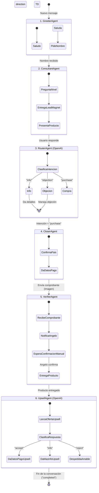

# Arquitectura de Agentes de IA para Infoproducto

Este documento describe la arquitectura de agentes implementada en el backend para manejar el embudo de ventas de forma automatizada a través de WhatsApp.

## Flujo General

El sistema utiliza un enfoque de múltiples agentes especializados, donde cada agente tiene un propósito específico en el embudo de ventas. El estado de la conversación se mantiene en una base de datos SQLite (`whatsapp_agents.db`) y se actualiza a medida que el usuario avanza por el flujo.

## Descripción de los Agentes

### 1. GreeterAgent (`app/agents/greeter.py`)

- **Propósito:** Dar la bienvenida al usuario y obtener su nombre.
- **Fase:** Inicio del embudo.
- **Acciones:**
  - Saluda al usuario.
  - Pregunta su nombre.
  - Extrae el nombre y país (usando OpenAI si es necesario).
  - Pasa el control al `ConsultantAgent`.

### 2. ConsultantAgent (`app/agents/consultant.py`)

- **Propósito:** Diagnosticar el nivel del usuario y entregar un regalo personalizado (Lead Magnet).
- **Fase:** El Gancho (The Hook).
- **Acciones:**
  - Pregunta el nivel de experiencia (novato, intermedio, avanzado).
  - Usa OpenAI para clasificar la respuesta.
  - Entrega el Lead Magnet adecuado según el nivel.
  - Presenta el producto principal.
  - Pasa el control al `RouterAgent`.

### 3. RouterAgent (`app/agents/router.py`)

- **Propósito:** Clasificar la intención del usuario y enrutar la conversación.
- **Fase:** Calificación y Manejo de Objeciones.
- **Acciones:**
  - Usa OpenAI para clasificar la intención (`purchase`, `info`, `objection`, `unclear`).
  - Si es `purchase`, pasa el control al `CloserAgent`.
  - Si es `info`, proporciona más detalles del producto.
  - Si es `objection`, usa OpenAI para manejar la objeción de forma empática.

### 4. CloserAgent (`app/agents/closer.py`)

- **Propósito:** Cerrar la venta y proporcionar los datos de pago.
- **Fase:** Cierre.
- **Acciones:**
  - Confirma el país del usuario (para aplicar descuentos locales, ej. Ecuador).
  - Proporciona los datos bancarios o el link de pago internacional.
  - Instruye al usuario para que envíe el comprobante de pago.
  - Pasa el control al `VerifierAgent`.

### 5. VerifierAgent (`app/agents/verifier.py`)

- **Propósito:** Manejar la verificación del pago y entregar el producto.
- **Fase:** Entrega.
- **Acciones:**
  - Recibe la imagen del comprobante de pago.
  - Notifica al administrador (Angelo) vía WhatsApp para confirmación manual.
  - Una vez confirmado (vía API o comando), entrega el producto principal (PDF).
  - Lanza la oferta de Upsell.
  - Pasa el control al `UpsellAgent`.

### 6. UpsellAgent (`app/agents/upsell.py`)

- **Propósito:** Manejar la oferta post-compra (Upsell).
- **Fase:** Maximización de Valor.
- **Acciones:**
  - Usa OpenAI para clasificar la respuesta a la oferta de Upsell (`accept`, `info`, `reject`, `unclear`).
  - Si es `accept`, proporciona los datos de pago para el Upsell.
  - Si es `info`, da más detalles del curso avanzado.
  - Si es `reject`, se despide amablemente.
  - Marca la conversación como `completed`.

## Servicios Clave

- **`OpenAiService` (`app/services/openaiService.py`):** Encargado de todas las interacciones con la API de OpenAI (clasificación de nivel, intención, manejo de objeciones, extracción de datos).
- **`EvolutionApiService` (`app/services/evolutionApi.py`):** Maneja la comunicación con la API de Evolution para enviar y recibir mensajes de WhatsApp, simulando comportamiento humano (escribiendo, presencia).
- **`NotificationService` (`app/services/notificationService.py`):** Envía notificaciones al administrador (Angelo) sobre nuevos pagos o eventos importantes.

## Estado de la Conversación (`app/models/conversation.py`)

El estado de cada usuario se mantiene en la base de datos y se actualiza en cada paso. Campos clave:

- `current_agent`: Indica qué agente tiene el control actual.
- `*_step`: Rastrea el progreso dentro de un agente específico.
- `user_level`, `user_country`: Datos extraídos para personalización.
- `payment_confirmed`, `product_delivered`: Banderas de estado del flujo de compra.
